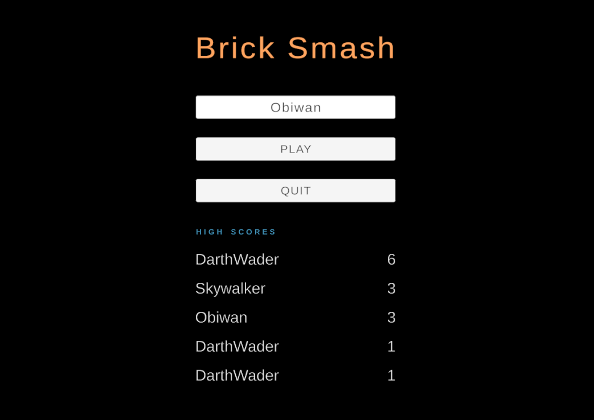

# Data Persistence in Unity

A simple mini game where you have to smash all bricks.

This project was to demonstrate the implementation of data peristence between two scenes and each user session.

- The "high scores" are persisted between each session (App quit and App start)
- The "best score" and "current player name" is persisted between the Menu scene and Gameplay scene

📎 This project was a part of Unity Junior Programer pathway [challenge](https://learn.unity.com/tutorial/submission-data-persistence-in-a-new-repo?uv=2020.3&labelRequired=true&pathwayId=5f7e17e1edbc2a5ec21a20af&missionId=5f751af7edbc2a0022cdbbb6#60b7cfceedbc2a001fe28b61)

👨🏾‍💻 Check out my Unity profile and projects [here](https://learn.unity.com/u/dhruv-bindoria?tab=profile)

### Menu

### Gameplay

